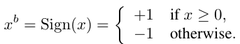
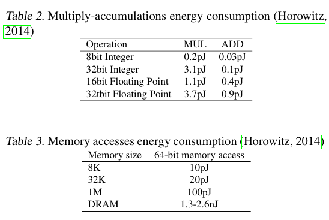
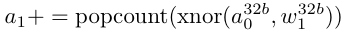
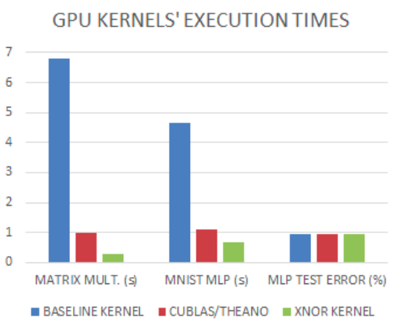

# Binarized Neural Networks: Training Neural Networks with Weights and Activations Constrained to +1 or −1
https://arxiv.org/pdf/1602.02830.pdf 

## How to Binarize

## Compare with Traditional NN
https://github.com/mmlind/mnist-1lnn

https://github.com/mmlind/mnist-dnn

| Method | Mnist-dnn | eBNN    |
|--------|-----------|---------|
| Time   | 153.421s  | 10.277s |
| Acc    | ~96%      | ~93%    |

## XNOR-Count
The calculations in the BNN become bit operations, a 32-bit multiplication loses 200 units, and a bit operation loses 1 unit.

## Performance Analysis

### Memory and computational energy

- Memory access takes more time than calculation
- Compared to the 32-bit DNN, the BNN memory requirement is reduced to less than 1/32 of the original, resulting in a 31/32 reduction in energy use.

## Optimization
- For bit operations, the SIMD parallelization instructions in the SWAR can be used for acceleration. The 32 binarized variables are stored in a 32-bit register, resulting in a 32x acceleration.

- In the process of neural network propagation, you can use SWAR technology to calculate 32 Connections using 3 instructions, as follows, so the original 32 time units now (accumulation, popcount, xnor) = 1 + 4 + 1 = 6 units Can be done, up to 5.3 times.

- To verify the above theory, two GPU compute cores were implemented, one with no optimized multiplication (baseline) and one with SWAR technology (XNOR) using the above formula. The results are as follows:

- XNOR is 23 times faster than baseline
- XNOR is 3.4 times faster than cuBLAS
